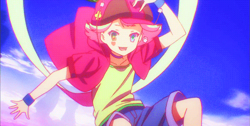

```js
> console.log("Hey there, I'm 'Hannah' — part code, part chaos 💿✨");
```
```zsh
> echo "🏳️‍⚧️ pronouns set to she/her — always and forever"
```
```lua
> system.os = "Tiny11 Pro" .. " + " .. "Arch Linux" -- dual boot is essential!
```
 <!-- ```diff
- text in red
+ text in green
! text in orange
# text in gray
@@text in purple (and bold)@@
```
-->



```c#
bio = {
  role = "🧪 Biochemical Researcher",
  side_quest = "💻 Part-Time Coder",
  skills = { "🎨 3D Modeling", "🖨️ FDM Printing" },
  passion = "🕶️ VR Technology",
  current_project = "🌐 Next-Gen VR Experience",
  personality = "✨Creative, Curious, Slightly Chaotic✨",
  discord = "@lil_hannah420"
}
```
